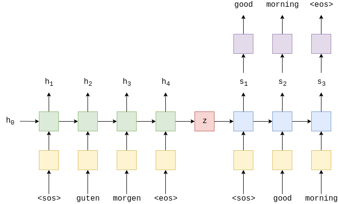

# Machine Translation
This is repository is about MT(Machine Translation) task.
From the RNN encoder-decoder model using LSTM to the SOTA model using PLM (Pretrained Language Model), it will be implemented and uploaded.

## Dataset
Dataset is from [AIHUB : Introduction to Korean-English Translation (Parallel) Corpora
](https://aihub.or.kr/aidata/87). Total dataset length is 1.6M and I split in to 1.4M, 190K, 10K for the train set, validation set, inference set.
If large dataset is used for inference, there will be overhead about calculating BLEU score. So I used small amount of dataset for inference. If you want measure more accurate score, then increase inference dataset.

### Tokenization
Each Paper about Translation task uses a different tokenizer. I will use the BPE tokenizer which is one of the subword segmentation methods.
If you want to know about the BPE tokenizer, please refer to the following  [paper](https://arxiv.org/pdf/1508.07909.pdf).
1. Korean 
   1. Korean is an agglutinative language. An agglutinative word has a suffix attached to the stem to determine its role in the sentence.
   2. So, first, I  will tokenize using the mecab from the konlpy package, and then use the BPE (Byte Pair Encoding) tokenizer.
2. English 
   1. I will tokenize English using the BPE tokenizer.

## Model
### 1. Sequence to Sequence Learning with Neural Networks

This model is from [Sequence to Sequence Learning with Neural Networks](Sequence to Sequence Learning with Neural Networks). 
Deep LSTM is used for  Mapping the input sequence into a vector with fixed dimensionality (Encoder).
Another deep LSTM is used to decode the soruce vector into a target vector representing the target sentence (Decoder).

Add `<sos>,<eos>` tokens at the beginning and the end to mark both ends of the input sentence. 
And put `<sos>` token as the first input of decoder. The vector created last by the decoder represents the `<eos>` token.

The purple block represents the generator. The generator receives the target vector from the decoder and selects the words with the highest probability through softmax.
